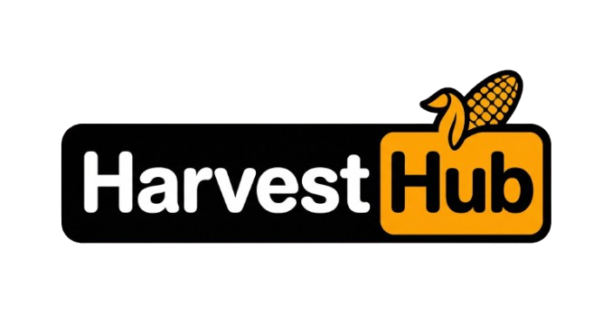

<div align="center">
  
  <h1>🌾 HarvestHub (AgriEngage Platform)</h1>
  <p>An AI-powered digital ecosystem empowering farmers with hyper-local intelligence, disease diagnosis, and a dual-mode e-commerce marketplace.</p>
  
  
  
  
  
  
  

</div>

## ✨ Features

- **🤖 AI Agronomist Chatbot:** Ask agricultural questions and receive real-time, expert-level guidance powered by Google Gemini.
- **📈 Crop Price Prediction:** Input your crop, region, and quantity to get an AI-forecasted price curve based on historical patterns and market factors.
- **🩺 Crop Disease Diagnosis (Computer Vision):** Upload a photo of an infected plant. The AI will instantly diagnose the disease, list severity, and provide chemical, organic, and preventative treatments.
- **🌱 Crop Recommendation Engine:** Evaluates current temperature, humidity, rainfall, and soil pH to recommend the best fitting crops for maximum yield.
- **☁️ Hyper-Local Weather Intel:** Fetches dynamic local farming advice depending on weather forecasts.
- **🛒 Digital Mandi Dashboard:** A fully built-in marketplace allowing farmers to track inventory, sell straight to consumers, and access nearby farm stores.

## 🛠 Tech Stack

- **Frontend:** React 19, Vite, Tailwind CSS (v4), Lucide React
- **Backend:** Node.js, Express (integrated monolith inside `server.ts`)
- **Database / Auth:** Firebase & Firestore
- **AI Models:** `@google/genai` (Gemini 2.5 Flash for language, vision, and tool calling)

## 🚀 Getting Started Locally

### Prerequisites
Make sure you have [Node.js](https://nodejs.org/) installed on your machine.

### Installation & Setup

1. **Clone the repository:**
   ```bash
   git clone https://github.com/arnavgangarde-beep/HarvestHub.git
   cd HarvestHub
   ```

2. **Install dependencies:**
   ```bash
   npm install
   ```

3. **Set up Environment Variables:**
   Rename `.env.example` to `.env` (or create a new `.env` file in the root directory) and add the following keys:
   ```env
   # Google Gemini AI Key
   GEMINI_API_KEY=your_gemini_api_key

   # Firebase Setup
   VITE_FIREBASE_API_KEY=your_firebase_key
   VITE_FIREBASE_AUTH_DOMAIN=your_firebase_domain
   VITE_FIREBASE_PROJECT_ID=your_project_id
   VITE_FIREBASE_STORAGE_BUCKET=your_storage_bucket
   VITE_FIREBASE_MESSAGING_SENDER_ID=your_sender_id
   VITE_FIREBASE_APP_ID=your_app_id
   ```

4. **Run the Development Server (with AI Backend):**
   ```bash
   npm run dev
   ```
   > Visit `http://localhost:3000` to interact with the platform.

## 🌍 Production Deployment

This project is built as a full-stack **Express & React** monolithic application, making it perfect for direct deployment as a Web Service on platforms like **Render**.

1. Create a new Node.js "Web Service" on **[Render.com](https://render.com/)**.
2. Connect this repository.
3. Set the Build Command to: 
   ```bash
   npm install && npm run build
   ```
4. Set the Start Command to:
   ```bash
   npm start
   ```
5. Add all your `.env` keys in the Render Environment Variables tab. The backend dynamically serves the built `dist/` directory!

*(Note: Deploying this complex monolithic setup to purely serverless platforms like Vercel is not recommended unless heavily configured within `vercel.json` and splitting API logic).*

---
Made with ❤️ for the future of farming.
